# Football Team Manager Web App

This is a web application for managing football teams, players, matches, and statistics. It includes a role-based login system (admin vs. regular user) with hashed password storage and full CRUD functionality.

## 🚀 Getting Started

To run this application locally:

1.  **Build the application:**
    ```bash
    dotnet build
    ```
2.  **Run the application:**
    ```bash
    dotnet run
    ```

Once the application starts, navigate to the following URL in your web browser:

[http://localhost:5112](http://localhost:5112)

You will be greeted by the login page.

### 🖼️ Login Page
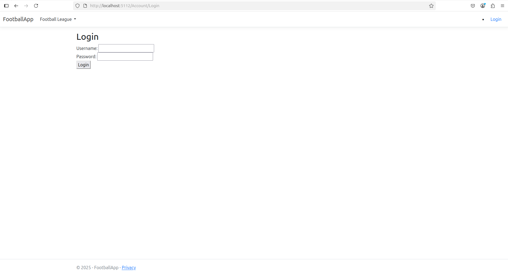

## 🔐 First Login

Use the following credentials to log in for the first time:

* **Username:** `admin`
* **Password:** `admin`

**Note:** Only the admin can manage users. Regular users will have limited access.

### 🖼️ Admin User Management Panel
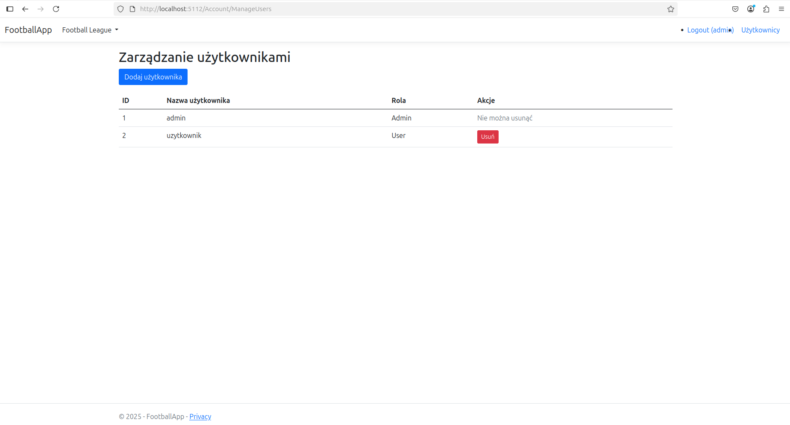

## 👥 Teams Management

In the "Teams" section, you can perform the following actions:

* **Add new teams.**
* **Edit existing team details.**
* **Delete teams.**
    * ⚠️ **Warning:** Deleting a team will also delete its associated matches. Players assigned to the deleted team will become "Free Agents."
* **While adding a new team, you can also:**
    * Add players to the team.
    * Include initial statistics for these players (goals, assists, appearances).
    * Schedule matches for the team.
        * If no result is provided for a match, it will be marked as "Upcoming".

### 🖼️ Teams View
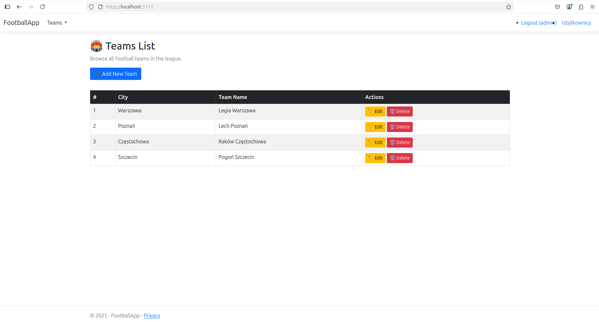

### 🖼️ Add Team with Players
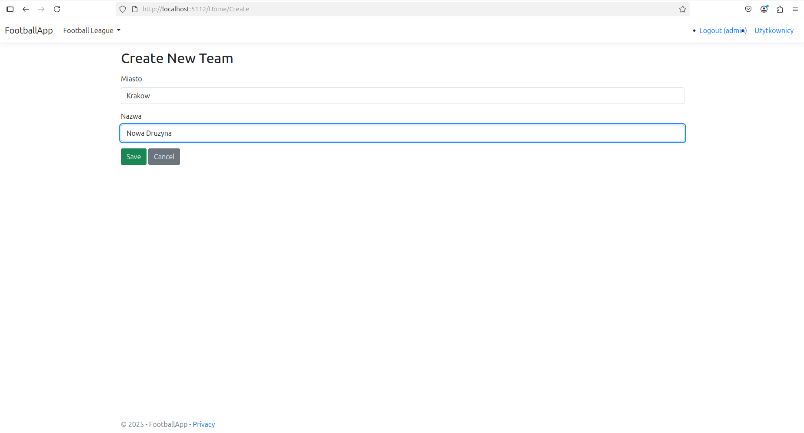
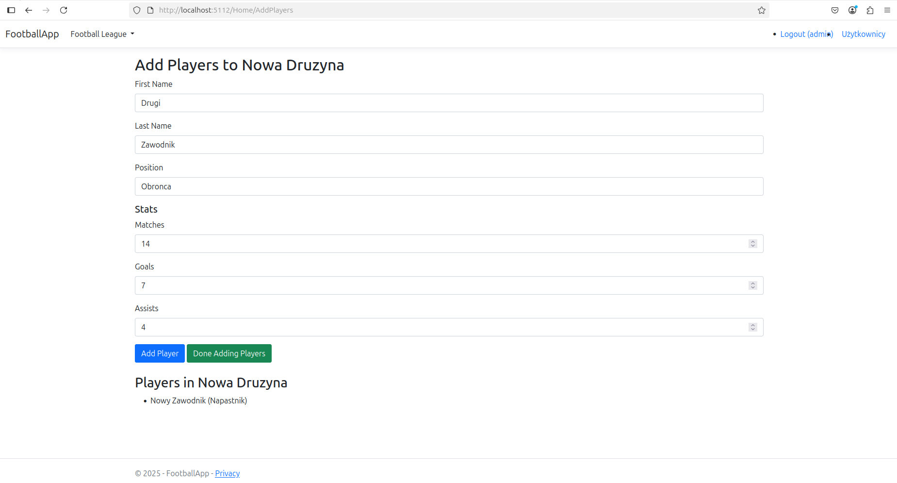

### 🖼️ Add Team with Matches


## 🧍 Players Management

In the "Players" section, you can:

* **Add new players** along with their initial statistics.
* **Edit player details** (name, surname, team).
* **Delete players.**
    * ⚠️ **Warning:** Deleting a player will also remove their statistics from the system.

### 🖼️ Players List
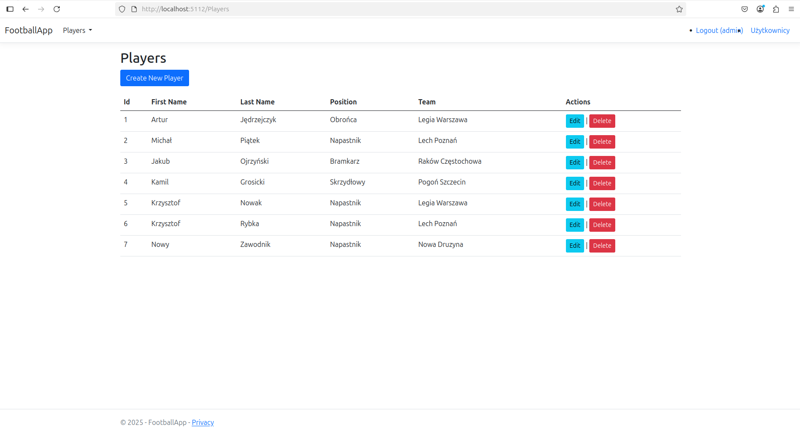

### 🖼️ Add Player
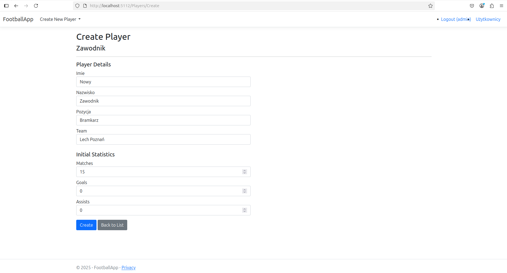

### 🖼️ Edit Player
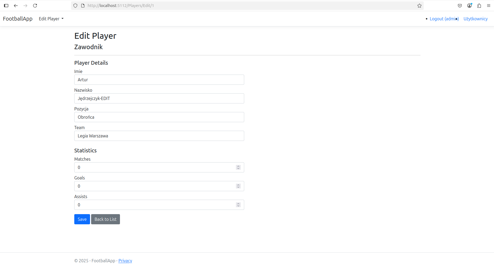

## 🏟️ Matches Management

The "Matches" section allows you to:

* **Add new matches** between teams.
* **Edit details of existing matches** (including scores).
* **Delete matches.**

### 🖼️ Matches List
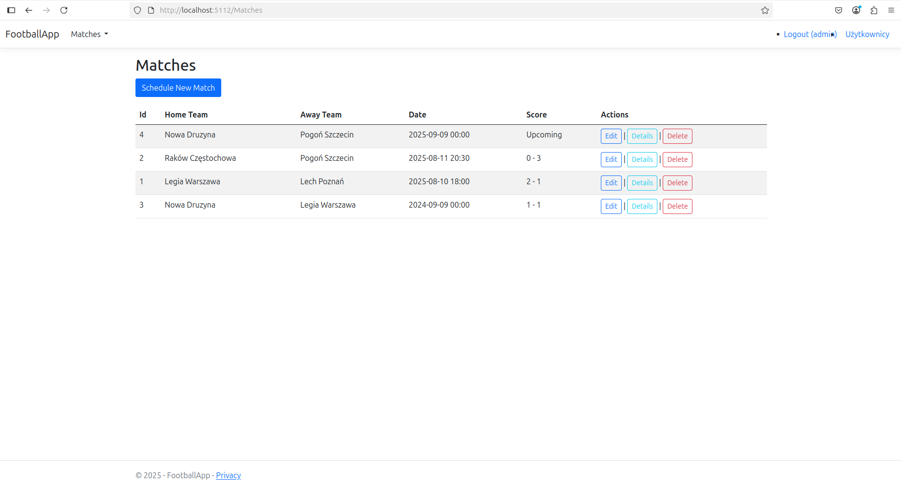

### 🖼️ Add Match
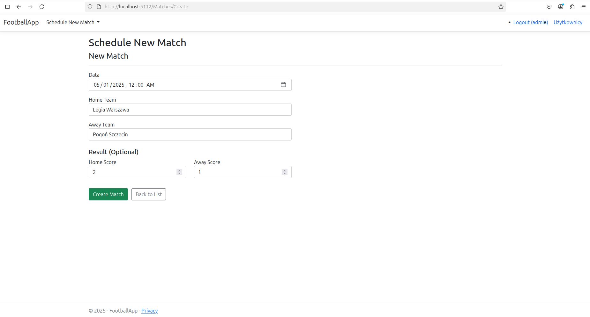

### 🖼️ Edit Match
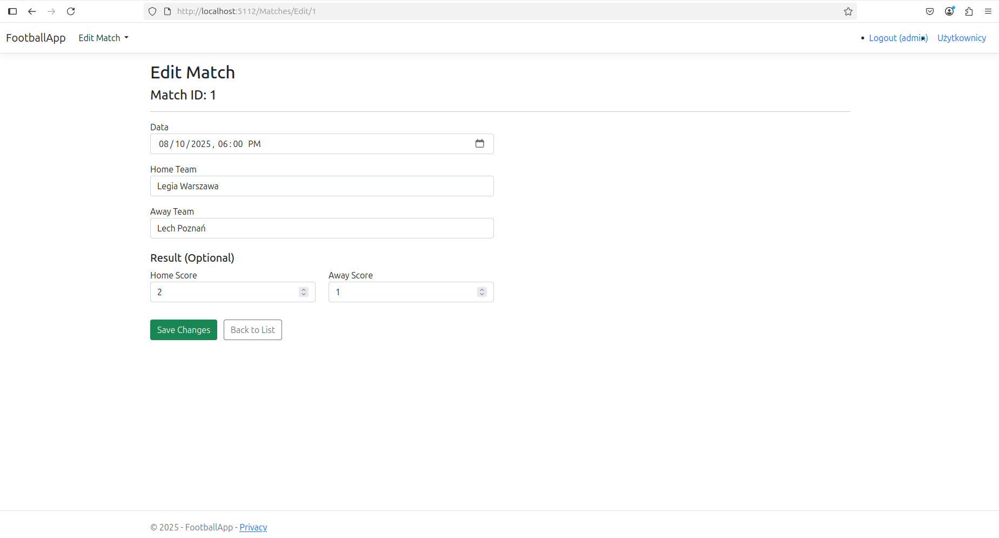

## 📊 Player Statistics

In the "Player Stats" section, you can:

* **View and edit the statistics** for each player, including:
    * Goals
    * Assists
    * Appearances

### 🖼️ Player Statistics View
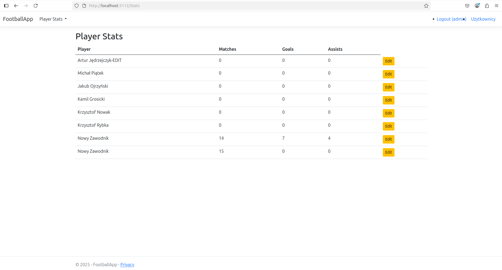

### 🖼️ Player Statistics Editor
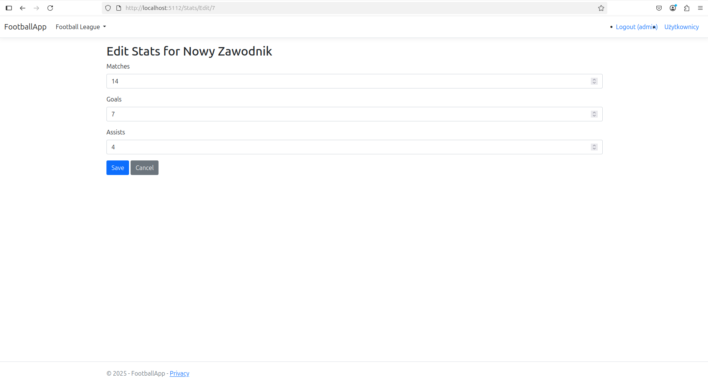

## 🥇 Top Scorers

The "Top Scorers" section displays the top 3 goal scorers in the league.

### 🖼️ Top Scorers View
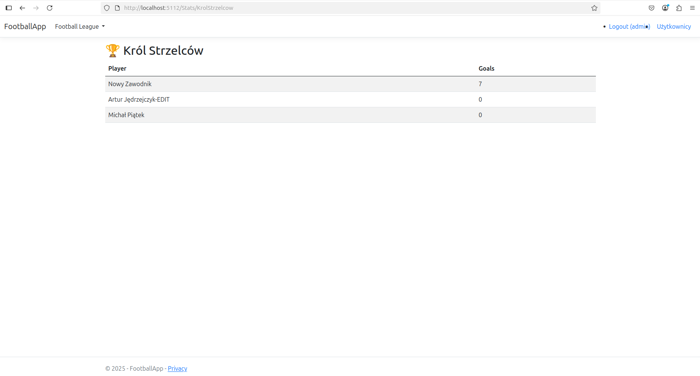

## 🔒 Authentication & Authorization

* **Admin users** have full access to all application sections, including user management.
* **Regular users** can view data and manage teams, players, matches, and statistics but cannot manage users.
* Passwords are stored securely using industry-standard **hashing techniques**.

## ⚙️ API Client Demo (For Developers)

Included in this repository is a separate project located in the `ApiClientDemo` folder. This project serves as a demonstration of how to interact with the application's API programmatically.

Inside the `ApiClientDemo` project, you will find a `Program.cs` file. This file contains example:
* **GET requests** to retrieve player data.
* **POST requests** to add new players.

You can examine and modify these examples to understand how to integrate with the player data API or to perform batch operations.
### 🖼️ API Client Demo
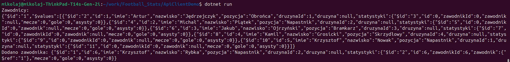